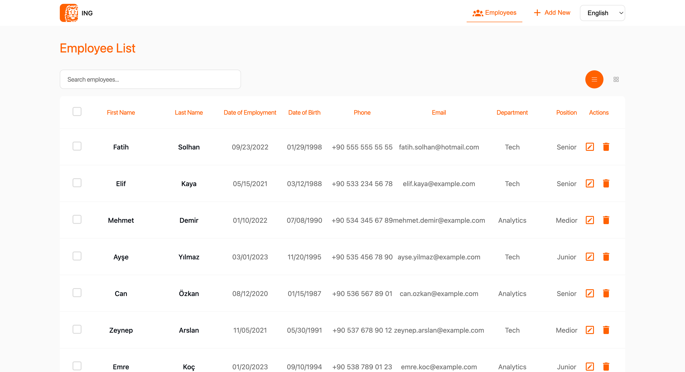

# Employee Management System

A modern web application built with LitElement for managing employee records, demonstrating proficiency in modern web technologies and best practices.

[](https://github.com/fatihsolhan/employee-crud/actions)
[](https://codecov.io/gh/fatihsolhan/employee-crud)



## ✨ Features

### Core Functionality
- **📋 Employee Listing**: View employees in both table and card formats
- **🔍 Search & Filter**: Real-time search with pagination support
- **➕ Add Employee**: Create new employee records with validation
- **✏️ Edit Employee**: Update existing employee information
- **🗑️ Delete Employee**: Remove employees with confirmation prompts
- **📱 Responsive Design**: Mobile-first design without external CSS libraries

### Advanced Features
- **🌐 Internationalization**: Full Turkish and English language support
- **💾 State Management**: Browser-based persistence using localStorage
- **🧪 Comprehensive Testing**: 98% test coverage with @open-wc/testing
- **🎨 Modern UI**: Clean, professional interface with CSS custom properties
- **♿ Accessibility**: Built with accessibility best practices

## 🛠️ Tech Stack

- **Framework**: LitElement (JavaScript)
- **Routing**: Vaadin Router
- **Internationalization**: @lit/localize with XLIFF
- **Testing**: @open-wc/testing, Web Test Runner
- **State Management**: Custom EventTarget-based stores
- **Build Tools**: Rollup, Modern Web Dev Server
- **Code Quality**: ESLint, Prettier

## 🚀 Quick Start

### Prerequisites
- Node.js (v14 or higher)
- Yarn

### Installation

```bash
# Clone the repository
git clone <repository-url>
cd employee-crud

# Install dependencies
yarn install

# Start development server
yarn start
```

## 🎯 Features Implemented

This project successfully implements comprehensive employee management functionality:

### ✅ Core Requirements
- [x] LitElement web components
- [x] Employee CRUD operations (Create, Read, Update, Delete)
- [x] List and table view formats
- [x] Search and pagination functionality
- [x] Form validation with appropriate error handling
- [x] Confirmation prompts for destructive actions

### ✅ Technical Requirements
- [x] Vaadin Router integration
- [x] Responsive design without external CSS frameworks
- [x] localStorage-based state management
- [x] Turkish/English internationalization
- [x] 85%+ test coverage
- [x] Modern JavaScript with LitElement

### ✅ Validation Features
- Email uniqueness and format validation
- Phone number uniqueness and format validation
- Age restrictions (18-65 years)
- Employment date validation (no future dates)
- Required field validation for all inputs

## 🧪 Testing

The project maintains high test coverage with comprehensive unit tests:

```bash
# Run all tests
yarn test

# Run tests with coverage report
yarn test:coverage

# Run tests in watch mode during development
yarn test:watch
```

### Test Coverage Breakdown
- **Components**: Thoroughly tested UI interactions and rendering
- **Services**: Complete business logic and state management testing
- **Validation**: Comprehensive form validation testing
- **Internationalization**: Locale switching and persistence testing

## 🌐 Internationalization

The application supports both Turkish and English languages:

- **Dynamic Language Switching**: Change language without page reload
- **Persistent Settings**: Language preference saved in localStorage
- **XLIFF Format**: Industry-standard translation format
- **Fallback Support**: Graceful handling of missing translations

## 📱 Responsive Design

- **Mobile-First Approach**: Optimized for mobile devices
- **Flexible Layouts**: CSS Grid and Flexbox for responsive layouts
- **Touch-Friendly**: Appropriate touch targets and interactions
- **No External Dependencies**: Pure CSS without frameworks

## 🔧 Development

### Code Quality
- ESLint configuration for consistent code style
- Prettier for automatic code formatting
- Modern JavaScript features (ES2020+)
- Web Components best practices

### Architecture
- Component-based architecture with LitElement
- Event-driven state management
- Separation of concerns between UI and business logic
- Reusable utility functions and components

---

[Live Demo](#) | [Documentation](./requirements.md)
